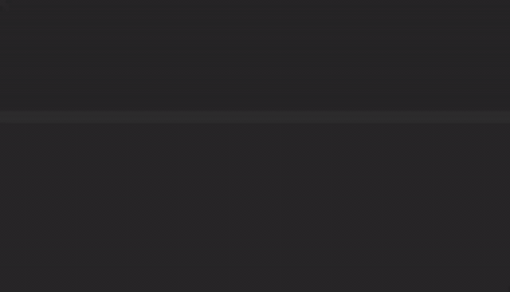

# R&D Engineer (New Tracing Team)
Epsagon is forming a new team to take our tracing libraries to the next level. We are looking for a research & development engineer with a passion for delivering solutions that makes customer's life easier.

## The Role
- Join our new tracing SDK team that is being formed to re-imagine our open-source tracing libraries, which are a core component in our product.
- Work in a diverse environment using multiple languages (Python, Node.js, Java, Go, .NET). Research and integrate with different technologies, cloud services & SDKs.
- Become highly involved in the open-source community, and contribute code to CNCF projects.

## We are looking for someone who has...
(We know the confidence gap and imposter syndrome can sometimes get in the way of meeting great candidates. Please don't hesitate to apply)
- 3+ years of proven experience with Python, Node.JS or Java
- Team player, with excellent communication skills
- SaaS, AWS services experience - a plus

## Apply now!

Send your CV to careers@epsagon.com

