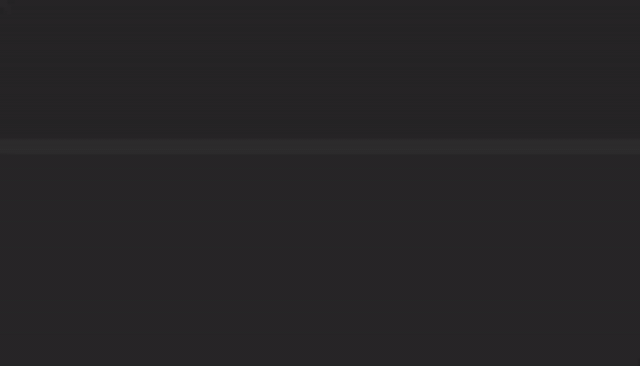

# Senior Fullstack Developer

## The Role

- Join a team responsible for Epsagon's **core traces engine**, as well as our Kubernetes offering - **one of the company's leading products**
- **Own** new features as well as existing components from **design to production** (monitoring and scaling up included)
- Use **cutting-edge technologies** including serverless functions, kubernetes, prometheus, DynamoDB, RDS, React and MobX
- Work with **smart, funny** and **caring people**

## We are looking for someone who has...

- 3-5 years of experience developing scalable distributed systems (backend)
- 2+ years of proven experience with JavaScript & React.
- Passion for getting things done
- Team player, with excellent communication skills
- Customer oriented approach
- SaaS, Python, AWS services experience - a plus

